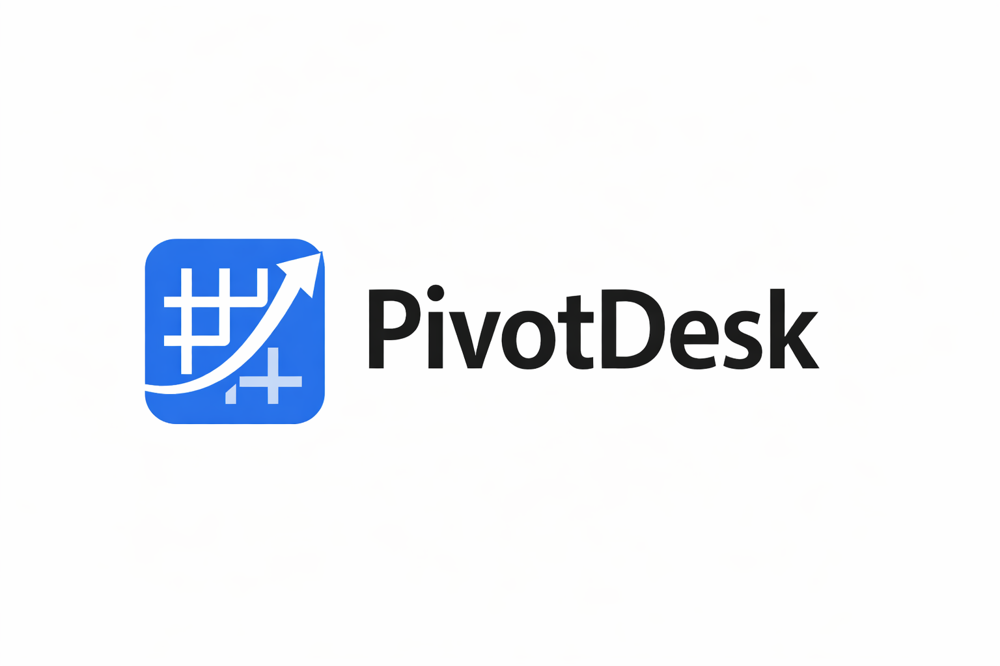
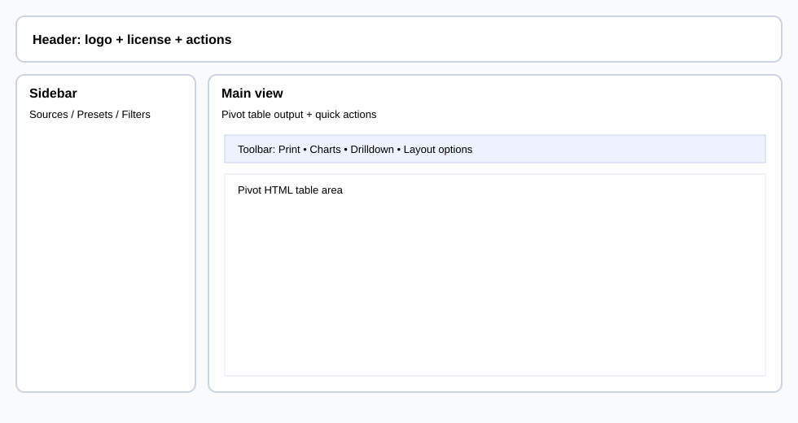
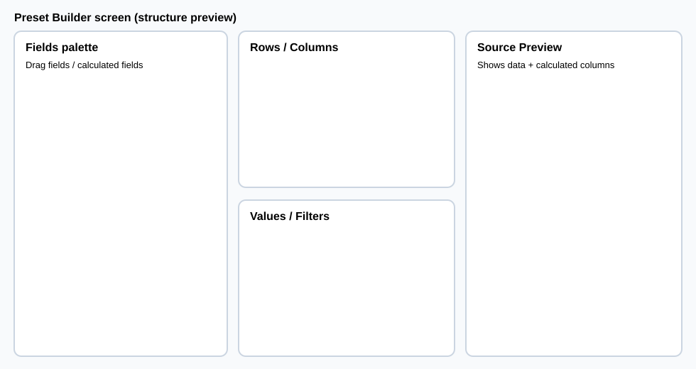
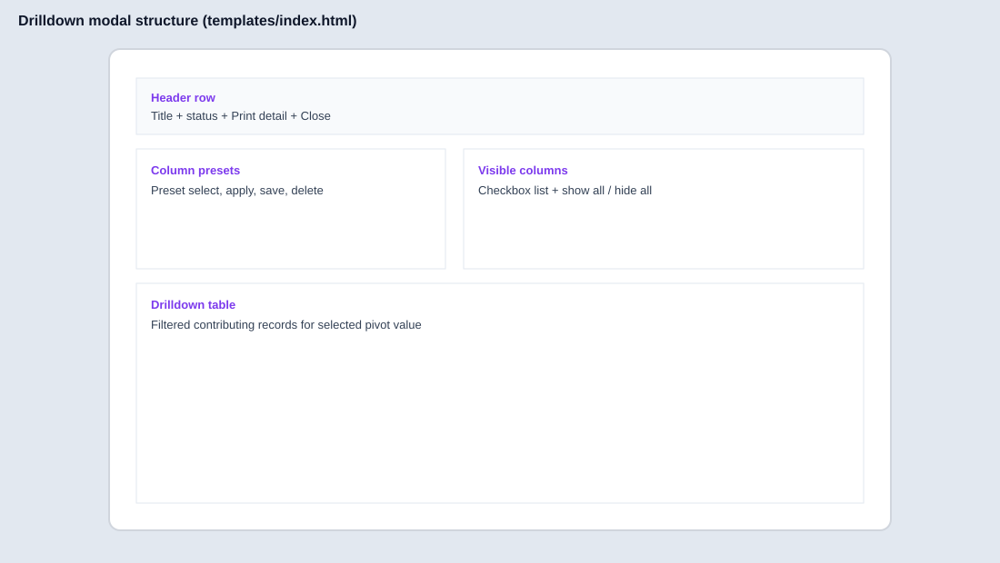
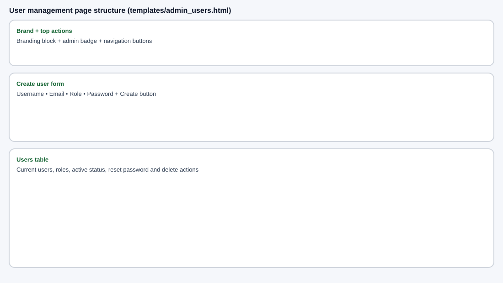

# PivotDesk

PivotDesk is a FastAPI + Pandas web application used to import business data, build dynamic pivots, and explore results in an interactive UI.



## Language docs

- **Primary docs (EN):** this file + [`docs/WIKI.md`](docs/WIKI.md)
- **Italian docs:** [`README.it.md`](README.it.md), [`docs/WIKI.it.md`](docs/WIKI.it.md)

---

## Project status

This repository is a working local-development baseline. Main components:

- FastAPI server (`app.py`)
- desktop/web launchers (`main.py`, `run_pivotdesk.py`, `tray.py`)
- pivot/data services (`services/`)
- licensing modules (`licensing/`)
- Jinja templates (`templates/`)

---

## Requirements

- Python 3.10+
- updated pip

Install core dependencies:

```bash
python -m pip install -r requirements-core.txt
```

Optional desktop/tray dependencies:

```bash
python -m pip install -r requirements-desktop.txt
```

---

## Run

Recommended for development:

```bash
python run_pivotdesk.py
```

Alternative launcher:

```bash
python main.py
```

Default URL:

- `http://127.0.0.1:8091`

---

## Default credentials

First run creates admin user:

- username: `admin`
- password: `admin`

Change this password immediately in shared environments.

---

## Quick feature overview

- Source ingestion: CSV, Excel (sheet selection), ODS, MySQL, HTTP JSON adapter.
- Pivot builder with saved presets.
- Calculated fields (server-side formula engine + UI assistant).
- Numeric-safe filtering and optional subtotals/totals.
- Chart modal (column/bar/line/pie) with print support.
- Drilldown/detail modal with column visibility presets.
- Pivot print output excludes interactive UI controls (e.g., drilldown buttons) for clean report exports.
- License-aware feature gating (including Free tier policy).
- LAN diagnostics/probe/firewall helper endpoints.
- Customer branding (logo upload + rendering in UI/print contexts).
- Backup/restore endpoints for presets/settings.
- UI localization (English/Italian).

## UI structure previews

The following diagrams are visual examples derived from the HTML layout structure, useful for onboarding and user documentation:






---

## Licensing notes (important)

- **Free tier:** CSV-based on-screen pivots only.
- Premium features such as print, charts, and drilldown are available only for paid/dev licenses (based on feature flags/policy).
- LAN exposure is license-controlled and validated by diagnostics endpoints.

---

## Useful paths

- `app.py` – main API/web entrypoint
- `services/pivot_engine.py` – pivot transformation logic
- `services/source_manager.py` – source loading pipeline
- `plugins/calculated_fields/backend.py` – formula engine
- `templates/` – frontend pages
- `static/js/` – frontend logic
- `docs/WIKI.md` – full internal wiki (EN)

---

## Troubleshooting

- Missing dependencies: reinstall requirements.
- Port already in use: update `config.json` or stop the running process.
- Missing templates/static assets: verify repository structure is intact.
- LAN issues: check `/lan/status`, run probe endpoints, and verify firewall state.
