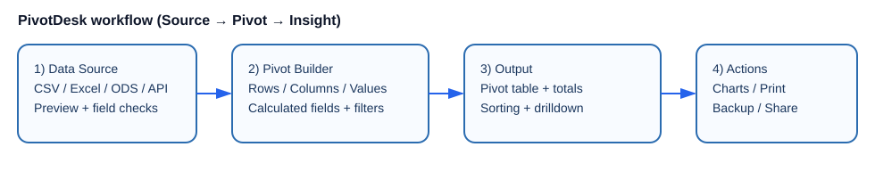
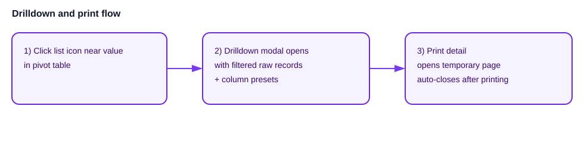
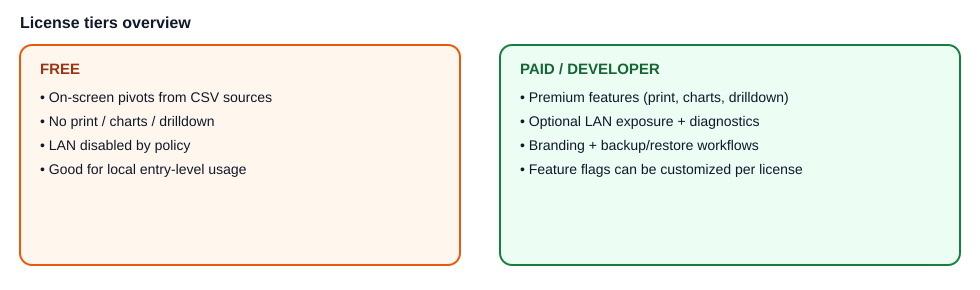

# PivotDesk Wiki interna

Questa guida raccoglie in un unico documento le funzionalità principali di PivotDesk (utente + amministrazione).

---

## 1) Panoramica

PivotDesk è un’applicazione web (FastAPI + Pandas) con launcher desktop/tray per:

- importare dati da sorgenti (CSV, Excel, ODS, MySQL, HTTP JSON);
- creare e salvare pivot configurabili;
- usare campi calcolati riga per riga;
- filtrare, ordinare, visualizzare subtotali/totali;
- generare grafici dalla pivot;
- aprire il dettaglio record (drilldown) dai valori pivot;
- stampare pivot/grafici/dettagli;
- gestire licenze, LAN, branding e backup/ripristino.

---

## 2) Avvio rapido

### Requisiti
- Python 3.10+
- dipendenze da `requirements-core.txt`

### Avvio
- sviluppo: `python run_pivotdesk.py`
- launcher principale: `python main.py`

URL locale predefinito: `http://127.0.0.1:8091`.

Credenziali iniziali: `admin / admin` (da cambiare subito).

---

## 3) Sorgenti dati

## Tipi supportati
- CSV
- Excel (`.xlsx`, `.xls`, `.xlsm`) con selezione foglio
- ODS
- MySQL
- HTTP JSON (`http_json`, `api`, `rest`)

## Note operative
- CSV usa un parser tollerante (encoding/delimiter/quoting).
- Per Excel è disponibile il caricamento elenco fogli direttamente nel form sorgente.
- Con licenza **Free** sono consentite pivot solo da sorgenti CSV.

---

## 4) Preset pivot e builder

Un preset salva:
- filtri;
- righe;
- colonne;
- valori (aggregazioni);
- opzioni vista (subtotali, totali, ordinamento…);
- campi calcolati associati.

## Funzioni principali
- crea/modifica preset;
- anteprima sorgente;
- caricamento/salvataggio JSON preset;
- import/export via backup amministrativo.

---

## 5) Campi calcolati

## Cosa sono
Colonne virtuali calcolate server-side su ogni riga della sorgente.

## Funzioni disponibili (estratto)
- Testo: `trim`, `upper`, `lower`, `replace`, `concat`, `after`, `before`, `token_after`
- Data: `year`, `month`, `day`
- Numero: `to_number`, `round`
- Orari: `minutes_diff`, `hours_diff`
- Logica: `if_else`, confronti (`>=`, `<=`, `==`, `!=`, `>`, `<`)

## UI assistita
- wizard funzioni con categorie;
- drag&drop campi nella formula;
- validazione formula e gestione tipo output.

---

## 6) Filtri, ordinamento, subtotali e totali

- Filtri colonna e filtri header.
- Ordinamento numerico per valori numerici.
- Comparazione numerica robusta in filtro (`1` equivalente a `1.0`).
- Subtotali/totali opzionali in vista pivot.

---

## 7) Grafici da pivot

Dalla pivot puoi aprire il modal grafico e scegliere:
- tipo: colonne, barre, linea, torta;
- campo etichetta/valore;
- Top N.

Supportata stampa grafico dedicata, con metadati e (se licenza attiva) logo cliente in testata.

Uso consigliato per tipo grafico:
- **Colonne:** confronto valori assoluti tra categorie.
- **Barre:** come colonne, ma più leggibile con etichette lunghe.
- **Linea:** andamento/trend su categorie ordinate.
- **Torta:** quota parte-su-totale con numero categorie contenuto.

---

## 8) Drilldown (dettaglio record)

Dalla tabella pivot è disponibile icona lista vicino ai valori per aprire il dettaglio record che compone il valore selezionato.

## Modal dettaglio
- tabella record filtrata;
- mostra/nascondi colonne;
- preset locali colonne (salva/applica/elimina);
- stampa dettaglio.

## Note licenza
- Drilldown è funzione premium (bloccata in Free/demo se non abilitata).

---

## 9) Stampa

Sono previste stampe dedicate per:
- pivot;
- grafico;
- dettaglio drilldown.

Con impostazione `print_show_logos` attiva, nelle stampe vengono inclusi i loghi footer; quando disponibile, compare anche il logo cliente in header (contesto licenza non demo).

---

## 10) Licenze e livelli funzionali

## Free
- pivot a video da CSV;
- niente stampa, grafici, drilldown, backup/restore premium;
- LAN non prevista.

## Licenze a pagamento / dev
- accesso funzionalità premium (in base ai feature flag licenza);
- possibile abilitazione LAN;
- branding cliente, backup/restore, grafici, drilldown, stampa.

---

## 11) LAN, diagnostica e firewall

Endpoint utili:
- `GET /lan/status`
- `POST /lan/probe/new`
- `GET /lan/probe/{id}`
- `GET /lan/probe/result`
- `POST /lan/firewall/open`

Uso tipico:
1. verifica stato LAN in modal licenza;
2. lancia probe;
3. se necessario apri firewall;
4. riavvia launcher in modalità coerente con licenza.

---

## 12) Branding cliente

Per admin/licenze abilitate:
- upload logo cliente;
- visualizzazione su login/header;
- inclusione nei layout di stampa supportati.

---

## 13) Gestione utenti (admin)

La gestione utenti è disponibile nella pagina dedicata (`templates/admin_users.html`) e include:

- creazione utente (username, email, ruolo, password);
- gestione ruolo e stato attivo;
- reset password ed eliminazione utente;
- scorciatoie di navigazione per tornare all’app principale.

---

## 14) Backup e ripristino

Endpoint:
- `GET /admin/backup/export`
- `POST /admin/backup/restore`

Coprono preset e impostazioni principali, utili per migrazione/rollback configurazione.

---

## 15) Internazionalizzazione (i18n)

Cataloghi disponibili:
- `static/languages/it.json`
- `static/languages/en.json`

Lingua selezionabile da UI impostazioni.

---

## 16) Usabilità layout home

Nella dashboard principale (`templates/index.html`) i controlli sono stati concentrati in una griglia compatta:

- Sorgente dati
- Preset
- Filtri pagina
- Barra rapida layout/opzioni

Ogni pannello include il toggle **Mostra/Nascondi** per comprimere le sezioni meno usate e mantenere la pivot più in alto, riducendo lo scrolling.

---

## 17) Struttura progetto (riferimento rapido)

- `app.py` → API/route principali
- `services/pivot_engine.py` → motore pivot
- `services/source_manager.py` → gestione sorgenti
- `plugins/calculated_fields/backend.py` → engine formule
- `templates/` → frontend Jinja
- `static/js/` → logica UI
- `run_pivotdesk.py`, `main.py`, `tray.py` → launcher/tray

---

## 18) Troubleshooting sintetico

- Porta occupata → cambia `config.json` o chiudi processo attivo.
- Sorgente non valida → verifica path/foglio/encoding.
- Funzioni bloccate → verifica licenza e feature flag.
- LAN non raggiungibile → usa `GET /lan/status` + probe + firewall.
- Template mancanti → controlla cartella `templates/`.

---

## 19) Checklist operativa consigliata

1. Configura sorgente.
2. Crea preset pivot.
3. (Opzionale) aggiungi campi calcolati.
4. Salva e testa filtri/subtotali.
5. Verifica grafico/drilldown/stampa secondo licenza.
6. Esegui backup configurazione.
